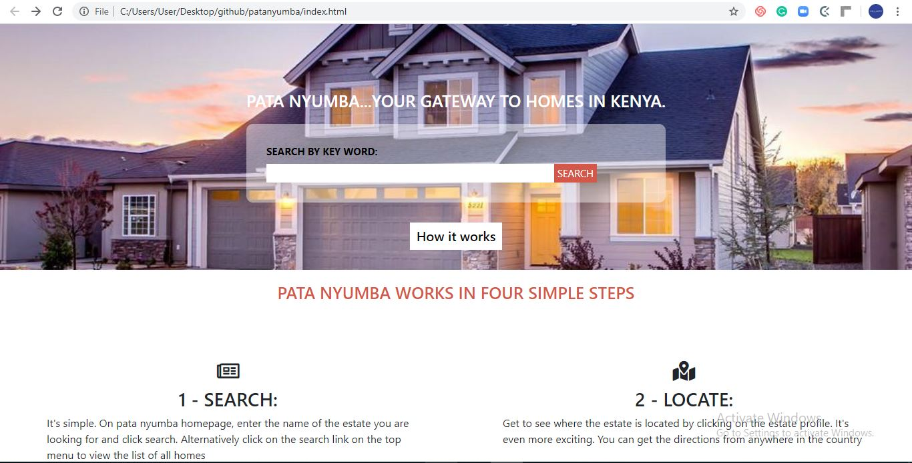

## Patanyumba website

In this project, I got the chance to build a web app. The UI looks like <a href="https://www.behance.net/gallery/25563385/PatashuleKE">this.</a>

Here's the screenshot of my work

Here's a <a href="https://raw.githack.com/imhilla/patanyumba/home-page/index.html">live link</a> of the front page.

Here is how the web app is structured:
The web page is divided into four main parts as below;

1. The main webpage

This page consists of the header and the footer. It has a background image with a clear description of the site. The user has a chance to know how everything works. Pata nyumba works in four ways. This leads to four steps and later other three pages. The user searches, locates, applies and waits for a reply.

Below it there are links to the other pages

2. Sign up page

The user if interested will have the opportunity to sign up before making an application. The sign up page has a form which must be filled.

3. Search page

In this page we allow the user to use dropdown menus to easily figure out which county, location and home she could get.

4. Homes page

This is the results page for every homes in the webpage. It has the name of the home found and its properties.

## Live Demo

## How to set up in local machine

Pata nyumba is easier to setup. You can use Sourcetree, Git from the command line, or any client you like to clone your Git repository. These instructions show you how to clone your repository using Git from the terminal.
First, from the repository, click + in the global sidebar and select Clone this repository under Get to work.
Secondly, Copy the clone command (either the SSH format or the HTTPS).
If you are using the SSH protocol, ensure your public key is in github and loaded on the local system to which you are cloning.
Forth, From a terminal window, change to the local directory where you want to clone your repository.
Paste the command you copied from Github.

If the clone was successful, a new sub-directory appears on your local drive in the directory where you cloned your repository. This directory has the same name as the github repository that you cloned. The clone contains the files and metadata that Git requires to maintain the changes you make to the source files. At that point you will be ready to view patanyumba files and install the locally.

## Built With

- HTML,
- CSS,
- Google Chrome Developer tools,
- Bootstrap
  -Media queries

## Authors

👤 **Kiptoo Hillary**

- Github: [@githubhandle](https://github.com/imhilla)
- Twitter: [@twitterhandle](https://twitter.com/hillarykiptoo_)
- Linkedin: [linkedin]()
- Email: [Email](hillaryodhiambo282@gmail.com)

🤝 Contributing
Contributions, issues and feature requests are welcome!

Show your support
Give a ⭐️ if you like this project!
